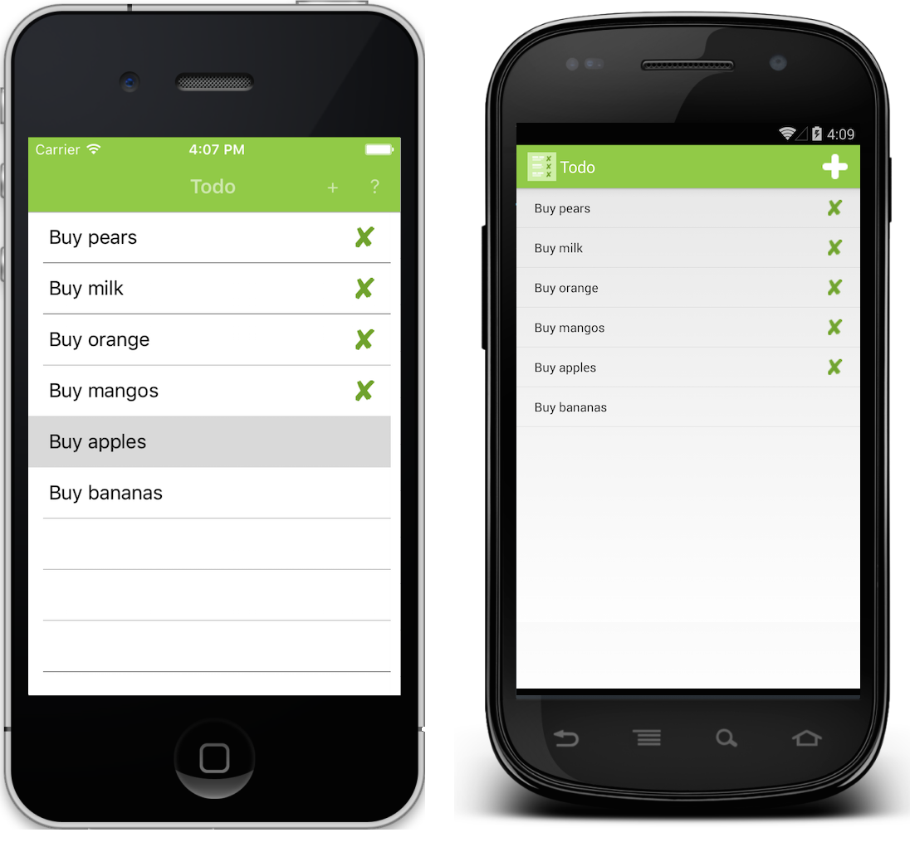

# TimeClock

This sample demonstrates a TimeClock list application where the data is stored and accessed in a local SQLite database.

The app functionality is:

- View a list of tasks.
- Add a new item to the list of tasks.
- Set a task's status to 'completed'.

In all cases the tasks are stored in a local SQLite database.

For more information about the sample see [Working with a Local Database](https://docs.microsoft.com/xamarin/xamarin-forms/data-cloud/data/databases).

